[資料庫正規化筆記](https://blog.build-school.com/2022/07/22/資料庫正規化筆記/)
===
###正規化概念
資料庫正規化，又稱正規化、標準化，是資料庫設計的一系列原理和技術，以減少資料庫中數據冗餘，增進數據的一致性。  
現在資料庫設計最多滿足3NF，普遍認為正規化過高，雖然具有對數據關係更好的約束性，但也導致數據關係表增加而令資料庫IO更易繁忙。
###定義
將原先關聯表格的所有資訊，在分解成其他表格後，仍可以透過「合併」新關聯表格的方式得到相同的資訊，亦為「無損失分解」（Lossless Decomposition）。
###不當設計造成的異常
- 新增異常：新增時，資料不齊全。
- 刪除異常：刪除時，造成資料遺失。
- 更新異常：更新時，可能會漏改。
###小結
正規化的目的就是為了刪除「重複的資料」(Data Redundancy)及「避免更新異常」(Anomalies)，每個階段都是以「欄位的相依性」作為分割資料表的依據，在實務上通常以滿足3NF即可。
###來看個例子
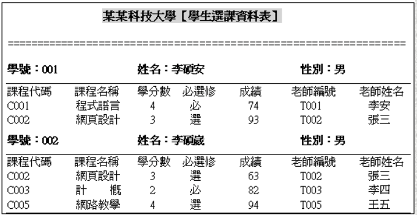  
###不當設計的影響
- 新增異常：
	- 新增學生，但未選課
	- 新增課程，但未被選課
	- 新增老師，但未授課
- 刪除異常：
	- 刪除課程時，學生的成績資料遺失
- 更新異常：
	- 更新課程資料時，需一次修改多筆資料
	- 更新老師資料時，需一次修改多筆資料
###正規化步驟
####先把資料儲存在資料表內(未正規化的資料表)
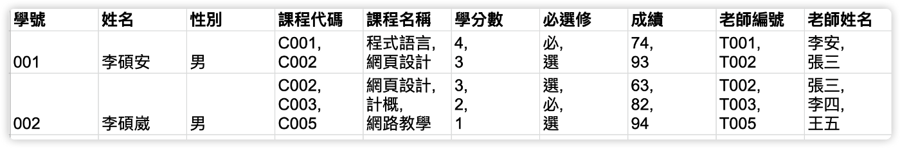  
####未符合第一正規化造成的問題
單一個欄位內有超過1個以上的值。  
欄位長度無法確定（可能很多，也可能很少），必須預留空間，造成儲存空間的浪費。
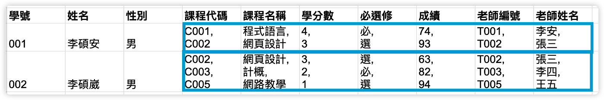  
###第一正規化（1NF）
####定義
1. 要排除重複群的出現，要求每一列資料的欄位值都只能是單一值（基元值）。
2. 沒有任何兩筆以上的資料完全重複。
3. 資料表中需有主鍵（唯一值），其他所有欄位都相依於主鍵。
4. 同一張資料表內，不建議用多個欄位表達同一個事情（如下圖）。
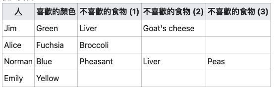  
####作法
1. 確認是否有重複表達的欄位。
2. 將欄位內重複的資料分別存為不同的Data Row資料。
####回到選課表
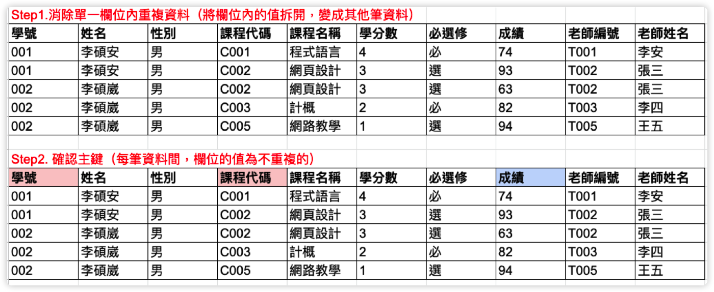  
可以將學號&課程代碼組合成唯一值（Key），透過學號&課程代碼，可以修改成績。
###第二正規化（2NF）
####定義
1. 符合1NF。
2. 消除「部分功能相依」，每一個非鍵欄位必須完全相依主鍵（學號=>學生，課程=>學分…），通常「主鍵有多個欄位」組成時會發生「部分功能相依」。
####作法
1. 檢查是否存在「部分功能相依」（可從多個欄位組成的主鍵開始檢查）。
2. 將「部分功能相依」的欄位分割出去，另外組成新的資料表。
####回到選課表
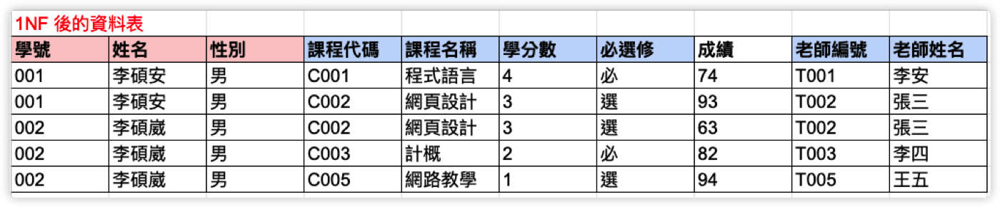  
主鍵是由「學號」與「課程代碼」組成：  
- 姓名、性別，相依於 「學號」
- 課程名稱、學分數、必選修、老師編號、老師姓名，相依於「課程代碼」
####存在「部分功能相依」，需要將部分功能相依欄位分割（2NF），以下為分割後結果
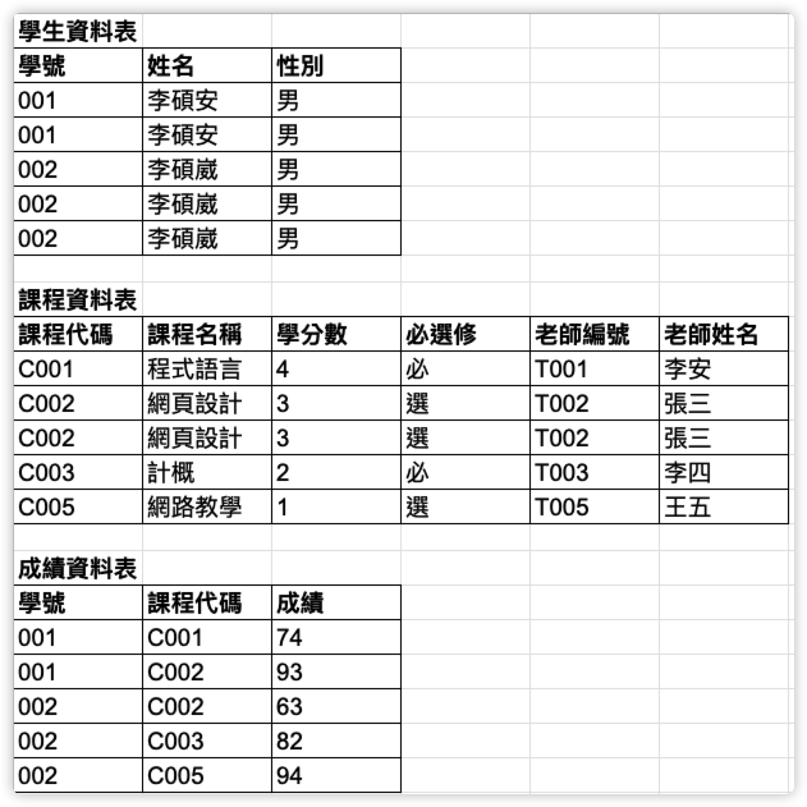  
發現「重複的資料」，因為需符合1NF，所以將重複的資料去除
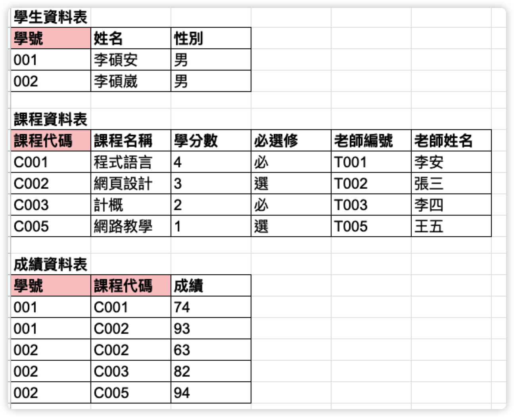  
紅底的欄位為「主鍵」
###第三正規化（3NF）
####定義
1. 符合2NF。
2. 各欄位之間沒有存在「遞移相依」的關係，也就是與「主鍵」無關的相依性。
####作法
1. 檢查是否存在「遞移相依」的欄位。
2. 將「遞移相依」的欄位分割出去，另外組成新的資料表。
####將有遞移相依的欄位分割出去
1. 檢查是否存在遞移相依（與主鍵無關的相依性）。
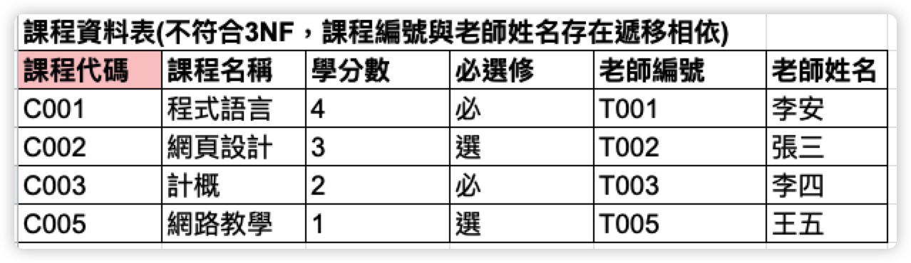  
	- 「老師編號」相依於「課程代碼」而且「老師姓名」相依於「老師編號」，所以「老師姓名」與「課程編號」（主鍵）為無關的相依。
	- 「老師姓名」與主鍵存在著「遞移相依」的關係。
2. 分割欄位
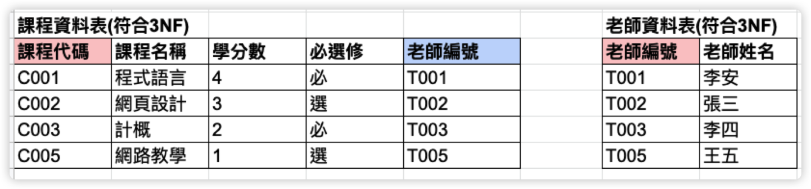  
###正規化結果
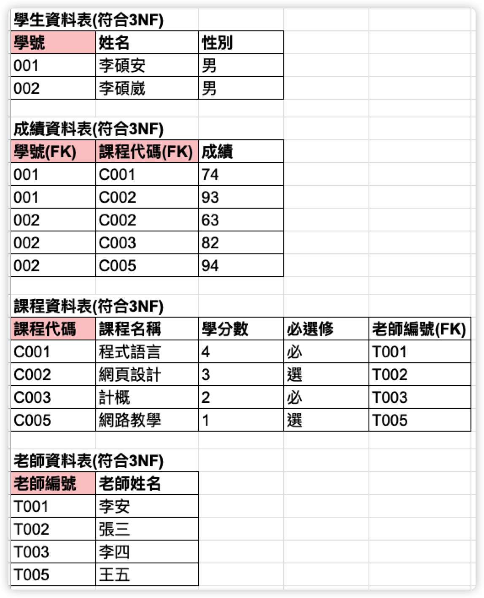  
###Boyee-Codd正規化（BCNF）
視情況使用，實務上大多都只會做到3NF。
####定義
- 3NF的改良式(必須滿足3NF)。
- 主鍵中的各欄位（單獨看）不可以相依於其他非主鍵的欄位。
####作法
1. 確認由多個欄位組成的主鍵是否有其他欄位相依於主鍵中的每個欄位。
2. 如有獨立相依的情況，新增一個獨立的主鍵欄位。
####確認資料表是否都有符合BCNF
- 學生資料表
	- 3NF
	- 單一主鍵
	- 符合BCNF
- 課程資料表
	- 3NF
	- 單一主鍵
	- 符合BCNF
- 老師資料表
	- 3NF
	- 單一主鍵
	- 符合BCNF
- 成績資料表
	- 3NF
	- 主鍵由兩個欄位組成，但：
		- 成績相依於「學號」及「課程代碼」欄位
		- 成績未相依於「學號」（必須要有課程代碼才知道是哪堂課的分數）
		- 成績未相依於「課程代碼」（必須要有學號才知道是誰的分數）
	- 符合BCNF
###Schema
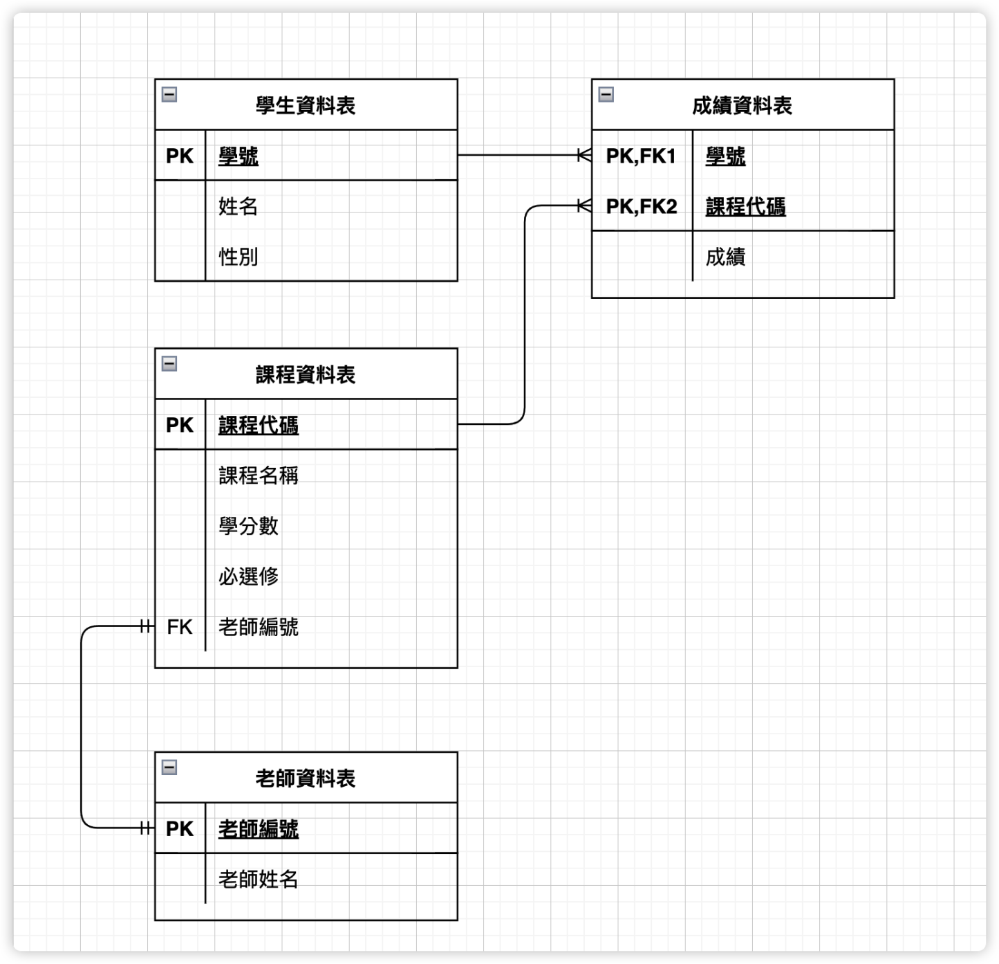  
###結論
- 每個階段的正規化，都會產生一個要解決的問題
	- 1NF:去除重複資料。
	- 2NF:去除部分功能相依。
	- 3NF:去除遞移相依。
	- BCNF:去除因功能相依產生的異常。
- 實務上我們都會做到第三正規化（3NF）。
- 設計不當的資料（未正規化），會導致異動操作可能會有問題。
	- 新增異常
	- 刪除異常
	- 更新異常
- 適當的正規化，可以確保數據資料的一致性。
- 當遇到資料處理速度上的困擾，或是因分割後造成的損失時，會將資料表「反正規化」。
	- 商品的庫存
	- 剩餘點數
	- …
- 在效能的考量之下的反正規化設計，需要小心控制「資料重複性的問題」及「更新的異常」。
###參考資料
- [參考1](http://cc.cust.edu.tw/~ccchen/doc/db_04.pdf)
- [參考2](http://debussy.im.nuu.edu.tw/sjchen/Database/Final/Ch05.pdf)
- [參考3](https://ithelp.ithome.com.tw/articles/10223029)
###其他筆記
* [回簡介](../README.md)
* [TypeScript](./chapter-02.md)